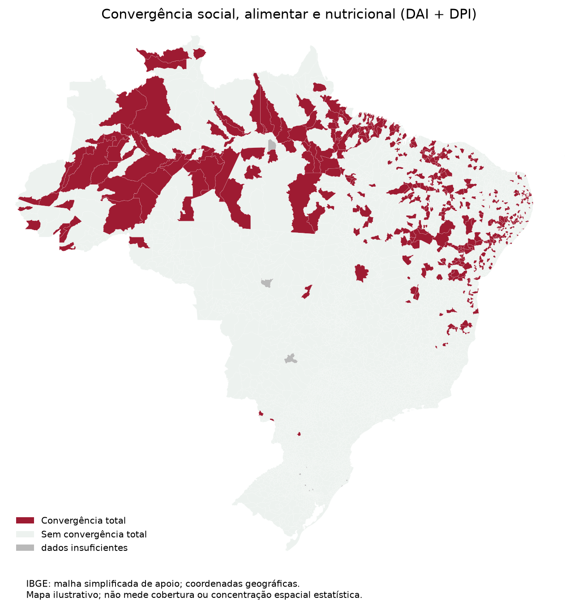

# Risco alimentar e vulnerabilidade social no Brasil

Análise exploratória com objetivo de identificar áreas do Brasil de maior risco alimentar e vulnerabilidade social

## Bases de dados utilizadas

| Entrada                      | Arquivo em`dados/pesquisa/`                                                                         | Referência                            |     Registros | Obtenção                                            |
| ---------------------------- | --------------------------------------------------------------------------------------------------- | ------------------------------------- | ------------: | --------------------------------------------------- |
| IVS e IDHM                   | [atlasivs_municipios_2010.csv](dados/pesquisa/ivs_idhm/atlasivs_municipios_2010.csv)                | 2010                                  |         5.565 | Cozinhas Solidárias; fontes originais Ipea/PNUD/FJP |
| CadInsan                     | [CADINSAN_2025_dados_municipais.csv](dados/pesquisa/cadinsan/CADINSAN_2025_dados_municipais.csv)    | Janeiro/2025                          |         5.570 | Cozinhas Solidárias; relatório original MDS         |
| SISVAN - Altura X Idade      | [CSV de altura](dados/pesquisa/sisvan/sisvan_municipios_altura_por_idade_0_a_menor_5_anos_2025.csv) | 2025; Crianças de 0 a menos de 5 anos |         5.571 | Relatórios públicos do Ministério da Saúde; 27 UFs  |
| SISVAN - Peso X Idade        | [CSV de peso](dados/pesquisa/sisvan/sisvan_municipios_peso_por_idade_0_a_menor_5_anos_2025.csv)     | 2025; Crianças de 0 a menos de 5 anos |         5.571 | Relatórios públicos do Ministério da Saúde; 27 UFs  |
| Malha municipal simplificada | [GeoJSON municipal](dados/pesquisa/apoio/ibge/malha_municipal_simplificada.geojson)                 | Ano não informado pela API            | 5.571 feições | IBGE, API de malhas v4; apoio ilustrativo           |

## Estratégia e indicadores

```text
CadInsan (%) = 100 × famílias em risco no cenário / famílias no universo CadInsan
DAI (%) = 100 × (Altura Muito Baixa + Altura Baixa) / Total de Altura X Idade
DPI (%) = 100 × (Peso Muito Baixo + Peso Baixo) / Total de Peso X Idade
```

| Dimensão    | Critério principal                                                           |
| ----------- | ---------------------------------------------------------------------------- |
| Social      | IVS ≥0,401**e** IDHM <0,600                                                  |
| Alimentar   | CadInsan ≥P75 nacional, cenário`com_PBF`                                     |
| Nutricional | DAI ≥6,7%**e** DPI ≥1,8%, com pelo menos 20 avaliações em **cada** relatório |

O P75 é calculado entre municípios com CadInsan válido e denominador positivo,
antes de aplicar os outros critérios; empates no corte são incluídos.
`com_PBF` e `sem_PBF` são cenários considerando/desconsiderando o efeito do PBF
na renda, não grupos disjuntos de beneficiários e não beneficiários.

A seleção principal exige as três dimensões. Ausências ou denominadores
insuficientes permanecem ausentes, mesmo quando outro componente é negativo.
A contagem de zero a três dimensões só existe para unidades inteiramente
classificáveis. Zero não significa ausência comprovada de vulnerabilidade.

Os cortes nutricionais e o mínimo de avaliações são referências adaptadas do
[Mapa InSAN 2017–2022](https://www.gov.br/mds/pt-br/Sisan/monitoramento-da-san/MapaInSAN_20172022.pdf).
Este experimento usa o recorte SISVAN de 2025, não filtra exclusivamente crianças
beneficiárias do PBF e não reproduz a clusterização desse estudo. O mínimo de
20 é uma escolha metodológica, não garantia de precisão ou representatividade.

DAI isolado é uma alternativa comparativa, não a seleção principal. O notebook
inclui 72 cenários de sensibilidade: CadInsan P70/P75/P80/P90; mínimos 20/50/100
em cada relatório; DAI 6,7%/10%/P75; cenários `com_PBF`/`sem_PBF`.
DPI permanece em 1,8% e os cortes sociais são fixos.
A estabilidade é uma fração de cenários, não uma probabilidade.

As faixas descritivas DAI da OMS são <2,5%; 2,5–<10%; 10–<20%; 20–<30%; ≥30%.
Não substituem o corte de seleção. Correlações de Spearman utilizam pares
disponíveis, com seus tamanhos informados, e não demonstram causalidade.
Percentuais de seleção regional usam os elegíveis da própria região;
DAI/DPI agregados são razões de somas, não médias simples dos percentuais.

### Altura, peso e limitações

O déficit de altura para idade sinaliza comprometimento do crescimento
geralmente crônico e acumulado: é relevante para investigar privação persistente
junto à vulnerabilidade social estrutural. Não comprova isoladamente insegurança
alimentar domiciliar nem uma causa específica.

Peso por idade pode refletir baixa estatura, déficit ponderal ou ambos; não
identifica exclusivamente magreza aguda. Baixo peso não é sinônimo de magreza,
e `Peso Elevado para a Idade` não equivale a diagnóstico de sobrepeso/obesidade.

DAI e DPI têm denominadores próprios. Sua conjunção é municipal, não individual:
não se sabe quantas crianças têm ambos os déficits, nem se os dois relatórios
acompanham as mesmas crianças. Não somar seus totais como pessoas distintas.
O SISVAN descreve o público acompanhado, não necessariamente toda a população.

Os códigos são lidos como texto: seis dígitos no SISVAN e sete nas fontes sociais
e na malha. A integração externa usa prefixos únicos de seis dígitos, verificando
duplicidades e conflitos e preservando os códigos originais. Não imputa índices
ou dígitos verificadores. As 5.571 unidades incluem municípios, Brasília e
Fernando de Noronha; não são 5.571 municípios constitucionais.

A comparação reúne referências de 2010 e 2025. Correspondência de códigos
não garante fronteiras históricas equivalentes; a malha não informa seu ano.
Os mapas são ilustrativos, sem inferência espacial formal.
O notebook explicita os casos sem índices de 2010 e as demais limitações.

### Formatos SISVAN

Os XLSX são os arquivos obtidos da fonte. Nos CSVs, os cabeçalhos multinível
foram achatados. As categorias oficiais permanecem separadas, com identificação
territorial, quantidade, percentual e total; não há DAI/DPI adicionados.

Há duas conversões históricas: altura conserva valores das células, incluindo
artefatos decimais do exportador; peso veio de uma conversão anterior que conciliou
contagens. Ambas são preservadas como utilizadas pelo experimento. Para ler:

```python
pd.read_csv(caminho, dtype="string", encoding="utf-8-sig", keep_default_na=False)
```

A leitura analítica concilia categorias, total e percentuais oficiais, com
tolerância de 0,011 ponto percentual. Inteiros coerentes são mantidos, **sem
multiplicação uniforme**. Decimais como `1.02` podem representar a escala do
exportador; somente linhas inconsistentes tentam conciliar células truncadas,
exigindo solução única. Inconsistência irresolvível interrompe a análise.
Valores da fonte e auditoria são exportados; as entradas não são reescritas.

## Resultados

Das **5.571 unidades municipais**, **5.561 são elegíveis** para a análise das
três dimensões e **10 têm dados insuficientes**. A convergência principal
identifica **508 unidades**, ou **9,14% dos elegíveis**. A alternativa com
DAI isolado identifica 548; não substitui a seleção principal com DAI e DPI.

O **Nordeste** concentra o maior número absoluto de unidades selecionadas: 371. O **Norte** tem a maior proporção entre os elegíveis da própria região:
123 de 449, ou 27,39%.



Arquivos para consulta e download:

- [Base municipal final](resultados/resultados/execucao_20261006T000733466193Z/base_municipal_final.csv) e [unidades com convergência principal](resultados/resultados/execucao_20261006T000733466193Z/municipios_convergencia_total.csv).
- Resumos [nacional](resultados/resultados/execucao_20261006T000733466193Z/resumo_nacional.csv), [regional](resultados/resultados/execucao_20261006T000733466193Z/resumo_regional.csv) e [por UF](resultados/resultados/execucao_20261006T000733466193Z/resumo_uf.csv).
- [Sensibilidade dos critérios](resultados/resultados/execucao_20261006T000733466193Z/sensibilidade.csv) e [estabilidade da seleção](resultados/resultados/execucao_20261006T000733466193Z/estabilidade.csv).
- [Cortes utilizados](resultados/resultados/execucao_20261006T000733466193Z/cortes.csv) e [dicionário de variáveis](resultados/resultados/execucao_20261006T000733466193Z/dicionario_variaveis.csv).
- [Síntese gerada pelo notebook](resultados/resultados/execucao_20261006T000733466193Z/resumo.md) e [manifesto com parâmetros, fontes, hashes das entradas e ambiente](resultados/resultados/execucao_20261006T000733466193Z/manifesto_execucao.json).
- [Execução completa em ZIP](resultados/resultados/execucao_20261006T000733466193Z.zip).

## Abrir e executar o notebook

Para consultar a análise e os resultados já executados, abra
[experimento.ipynb](experimento.ipynb) no GitHub.

Para executar no Google Colab, abra o mesmo arquivo e rode todas as células
em ordem. O código e cópias verificáveis das entradas estão incorporados:
não são necessários Drive, upload de CSV ou scripts locais.
Os parâmetros estão na primeira célula de código; a última etapa exporta um ZIP.

O Colab pode ter versões diferentes das bibliotecas de referência. O notebook
registra o ambiente real e informa divergências; não se pressupõe igualdade
de ambiente no Colab.

## Organização

```text
experimento.ipynb            análise completa com resultados
dados/pesquisa/              entradas congeladas, catálogos e metadados
dados/brutos/                XLSX SISVAN utilizados
metadados/manifestos/        registros das duas coletas
resultados/                 entradas, figuras, execuções e ZIPs gerados pelo notebook
scripts/                    coletor e cliente SISVAN
requirements.txt            dependências diretas para execução local
```

## Referências

- [Atlas IVS/Ipea](https://repositorio.ipea.gov.br/handle/11058/4381).
- [Atlas Brasil/PNUD](https://www.undp.org/pt/brazil/desenvolvimento-humano/atlas-do-desenvolvimento-humano-no-brasil).
- [CadInsan 2025/MDS](https://www.gov.br/mds/pt-br/Sisan/vigilancia-do-sisan/CADINSAN2025.pdf).
- [Relatórios públicos SISVAN](https://sisaps.saude.gov.br/sisvan/relatoriopublico/).
- [IBGE — API de malhas v4](https://servicodados.ibge.gov.br/api/docs/malhas?versao=4).
- [Mapa InSAN 2017–2022](https://www.gov.br/mds/pt-br/Sisan/monitoramento-da-san/MapaInSAN_20172022.pdf).
- [OMS — indicadores nutricionais infantis](https://www.who.int/data/nutrition/nlis/info/malnutrition-in-children).
